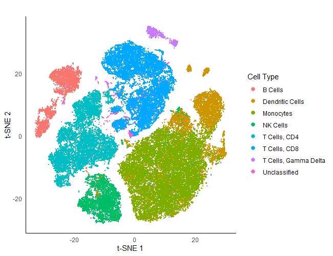
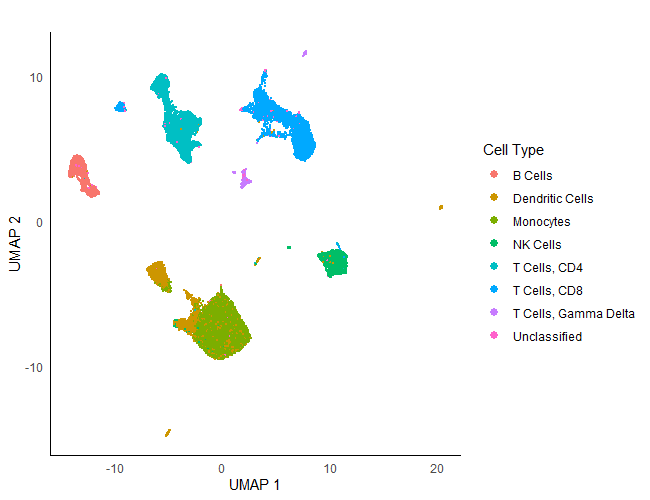

# BinaryClust
Tools for CyTOF analysis


## Introduction
CyTOF data is log normal with zero inflation for most markers. For example:


BinaryClust takes advantage of this feature to subset cells for clustering by performing binary classifications on the markers. Using _K_-means clustering (_K_ = 2), it is possible to automatically separate cells into positive and negative populations. Here, _K_-means breaks down the cells into CD3+ (red) and CD3- (blue) populations:


This process is done in BinaryClust on all the markers separately to generate a classification matrix. A user-defined selection criteria will then classify these cells into different populations, which will then be individually clustered:


BinaryClust also comes with a set of functions to perform standard analysis tasks such as data exploration and data visualisation by _t_-SNE or UMAP.


## Prerequisites and Installation
To intall BinaryClust, you will first need to install the R packages devtools and BiocManager:

```
install.packages('devtools')
install.packages('BiocManager')
```

Three Bioconductor packages are needed:

```
library(BiocManager)
install('ComplexHeatmap')
install('flowCore')
install('FlowSOM')
```

Then you can install BinaryClust and its dependencies:

```
library(devtools)
install_github("desmchoy/BinaryClust")
```

Don't forget to load the package after installation:

```
library(BinaryClust)
```

The original BinaryClust pipeline was designed for large-scale parallel runs on a high performance computing (HPC) facility. However, for reasonably sized samples, it can be used on local installations or via an IDE such as RStudio. though it is not recommended to run _t_-SNE or UMAP for large samples on a local installation due to computational demands.


## Quick Start
BinaryClust is designed to be efficient and straight to the point. A quick analysis can be run within seconds using a single command given an FCS file and a user-defined cell classification file in CSV format (see the following section for details):

```
BC.results <- run_BinaryClust('HD.fcs', 'cell_types.csv')
```

`run_BinaryClust` is a shortcut function that performs five individual steps of analysis (each elaborated in the following section) using default settings in one go and returns their results in one single object. The result is a list of four data frames that provides the inputs for plotting functions or further analysis. The first data frame gives you arcsinh transformed (cofactor 5) data:

```
> head(BC.results[[1]])
      CD45 CD196_CCR6      CD19 CD127_IL-7Ra       CD38       CD33        IgD
1 4.763022 0.00000000 0.0000000   0.00000000 0.02726449 0.00000000 0.00000000
2 3.912244 2.05420158 0.0000000   2.45454068 0.01258484 0.00000000 0.03181502
3 5.385946 0.00000000 0.0000000   1.71571358 0.00000000 0.21548775 0.00000000
4 4.951837 0.44154719 0.0000000   0.06832929 0.26353484 0.00000000 0.00000000
5 5.501669 2.19138813 0.8805520   0.31980510 3.11632848 2.74392043 0.12969393
6 5.213904 0.09108109 0.1907823   2.25250901 1.42557094 0.06746715 0.20465348
      CD11c      CD16 CD194_CCR4     CD34 CD123_IL-3R     TCRgd CD185_CXCR5
1 0.0000000 0.0000000  0.0000000 0.000000     0.00000 0.0000000           0
2 0.3241666 0.2583896  2.5192846 0.000000     0.00000 0.0000000           0
3 0.0000000 0.0000000  0.0000000 0.000000     0.11153 0.0000000           0
4 0.1237903 0.0000000  0.0000000 0.000000     0.00000 0.7061377           0
5 5.0112698 0.4296513  0.8198227 1.515479     0.00000 0.1518769           0
6 0.0000000 0.0000000  0.4235676 0.000000     0.00000 0.3448717           0
...
```

The second data frame gives you the median expressions of each marker and the abundance of each cell type definied in the cell classification file:

```
> head(BC.results[[2]])
        Cell.Type     CD45 CD196_CCR6       CD19 CD127_IL-7Ra      CD38
1         B Cells 5.175686  2.7822063 4.55294083   0.24782457 2.6548137
2 Dendritic Cells 4.973808  0.1735834 0.05988902   0.00000000 2.8594343
3       Monocytes 5.068816  0.2541294 0.07413499   0.06794235 3.6651274
4        NK Cells 4.780354  0.0000000 0.05407581   0.00000000 3.9153949
5    T Cells, CD4 5.146704  0.2767183 0.00000000   2.36491443 0.5727581
6    T Cells, CD8 5.126842  0.0000000 0.00000000   0.37595694 0.2547606
       CD33       IgD      CD11c       CD16   CD194_CCR4        CD34
1 0.1094124 4.3819244 0.08709911 0.02833477 0.0000000000 0.000000000
2 1.6333382 0.1881026 4.83674662 1.86184415 0.3341434080 0.212236144
3 2.4676174 0.2542666 4.75456686 1.06149001 0.4275743442 0.213740130
4 0.1222321 0.1060854 3.17299179 3.55946059 0.0002289466 0.007264909
5 0.0000000 0.0000000 0.00000000 0.00000000 0.5755964856 0.059087905
6 0.0000000 0.0000000 0.02973928 0.00000000 0.0000000000 0.000000000
...
CD4      CD14  CD56_NCAM       CD11b Frequency Percentage
1 0.8065952 0.0000000 0.00000000 0.000000000      4105   6.400262
2 3.2867254 0.4042923 0.07917726 0.054064754      7765  12.106707
3 3.5688402 2.8055202 0.19211170 0.058509953     18883  29.441205
4 0.1929261 0.0000000 4.05164056 0.007594521      5561   8.670367
5 5.4276076 0.3077517 0.25694324 0.000000000     11667  18.190464
6 0.1380546 0.0000000 0.16847492 0.000000000     14128  22.027503

```

The third data frame lists out exhaustively the clustering results of each cell type:

```
> head(BC.results[[3]])
     Cell.Type Cluster
1 T Cells, CD8       8
2 T Cells, CD4      32
3 T Cells, CD8       4
4 T Cells, CD8       9
5    Monocytes      30
6 T Cells, CD4      19
...
```

The fourth data frame summarises the clustering results. It gives the median expressions of each marker of each cluster of each cell type defined in the cell classification file and their abundances. It also leaves an empty `Cell.Subtype` column for filling for further analysis.

```
> head(BC.results[[4]])
  Cell.Type Cluster     CD45 CD196_CCR6     CD19 CD127_IL-7Ra      CD38
1   B Cells       1 5.169841   2.830101 4.535509   0.33521943 3.3112159
2   B Cells      10 5.088842   2.498848 4.502411   0.17985776 2.3036351
3   B Cells      11 5.400011   2.562452 4.672512   0.19210797 0.9343564
4   B Cells      12 5.389607   5.242463 4.983812   1.87714720 3.1863538
5   B Cells      13 5.360868   2.147824 4.561302   0.11040360 0.6605718
6   B Cells      14 4.105287   2.512916 4.147211   0.04629935 0.9779664
         CD33        IgD      CD11c      CD16 CD194_CCR4        CD34
1 0.289654941 5.41413151 0.09756387 0.1781481          0 0.003571104
2 0.000000000 0.00000000 0.04685361 0.0000000          0 0.000000000
3 0.006471317 3.81854993 0.00000000 0.0000000          0 0.000000000
4 0.238622565 5.00851295 0.07870780 0.1452360          0 0.020131121
5 0.000000000 0.07353001 0.03799469 0.0000000          0 0.000000000
6 0.000000000 2.67294214 0.00000000 0.0000000          0 0.000000000
...
CD14   CD56_NCAM       CD11b Frequency Percentage Cell.Subtype
1 0.000000000 0.006773511 0.000000000       164 0.25569865
2 0.000000000 0.000000000 0.000000000       135 0.21048364
3 0.000000000 0.000000000 0.000000000       134 0.20892451
4 0.000000000 0.000000000 0.000000000        37 0.05768811
5 0.004020624 0.000000000 0.005794109       114 0.17774174
6 0.000000000 0.000000000 0.006619664        79 0.12317191
```

These data frames can be used to generate plots using the relevant functions of `BinaryClust`. For example, the binary classification summary (second data frame) can be plotted out:

```
plot_binary_abundances(BC.results[[2]])
plot_binary_median(BC.results[[2]])
```

Each of these analysis steps will now be explained in the following section.


## Required Input Files
To run standard BinaryClust analysis for a single CyTOF file, two files are needed:

1. A CyTOF FCS file (formats prior to FCS 3.1 not tested)
2. A cell classification file in CSV format

##### The FCS File
Please remove spaces and special characters from the file name as they will interfer with the code

##### The Cell Classification File
The cell stratification file should be in CSV format. An example is shown below. 
```
Cell Type,CD14,CD16,CD161,CD19,CD20,CD3,CD4,CD56_NCAM,CD8,TCRgd
NK Cells,-,A,A,-,A,-,A,+,A,A
Dendritic Cells,-,A,A,-,A,-,A,-,A,A
Monocytes,+,A,A,-,-,-,A,A,A,A
B Cells,-,-,-,+,A,-,A,A,A,A
"T Cells, Gamma Delta",-,A,A,-,A,+,A,A,A,+
"T Cells, CD4",-,A,A,-,A,+,+,A,-,-
"T Cells, CD8",-,A,A,-,A,+,-,A,+,-
```

`+` means positively expressed, `-` means negatively expressed and `A` means "any". The marker name is determined by the `desc` column of the flowCore flowFrame object. Please use the `print_parameters` function to choose marker names (see Feature Selection section below). As exemplified above, if there is a comma `,` in the cell type name, please ensure to encircle it with quotation marks.


## Feature Selection
Assuming you have an FCS file called `HD.fcs`, before loading the data, you can examine the marker distributions with the function `examine_data`:

```
input.file <- '/your/data/directory/HD.fcs'
examine_data(input.file)
```

which will return a graph:


This will allow identification of markers that are sufficiently well-behaved for binary classification.


The `print_parameters` function will print the parameter page of the flowCore flowFrame object of the FCS file:

```
> print_parameters(input.file)
             name               desc   range minRange maxRange
$P1          Time               Time 1048576        0  1048575
$P2  Event_length       Event_length    4096        0     4095
$P3         Y89Di           89Y_CD45    4096        0     4095
$P4       Rh103Di              103Rh    4096        0     4095
$P5       Sn120Di              120Sn    4096        0     4095
$P6        I127Di               127I    4096        0     4095
$P7       Xe131Di              131Xe    4096        0     4095
$P8       Cs133Di              133Cs    4096        0     4095
$P9       Ba138Di              138Ba   65536        0    65535
$P10      Ce140Di         140Ce_Bead    8192        0     8191
$P11      Pr141Di   141Pr_CD196_CCR6    8192        0     8191
$P12      Nd142Di         142Nd_CD19    4096        0     4095
$P13      Nd143Di 143Nd_CD127_IL-7Ra    4096        0     4095
$P14      Nd144Di         144Nd_CD38   32768        0    32767
$P15      Nd145Di         145Nd_CD33    4096        0     4095
...
```

The `desc` column is used to select useful channels for analysis. When you load data, channels with underscore `_` will be chosen. Channels that contain 'Event_length', 'Bead', 'DNA', 'Live_Dead' and 'Viability' (case insensitive) are then removed. The remaining channels will have the heavy metal removed. Therefore, if the channel name is '89Y_CD45', the marker name will be 'CD45'. If the channel name is '141Pr_CD196_CCR6', the marker name will be 'CD196_CCR6'.


## Loading Data
The `load_data` function will import your FCS file via `flowCore` and return a data frame. By default, it will perform an arcsinh transformation with a cofactor of 5:

```
data <- load_data(input.file)
```

This output is identical to the first data frame of the Quick Start function. There are various options under `load_data` such as switching off data transformation, using a different cofactor or subsetting the data. Please find the details in the help pages by running `help(load_data)`.

Non-redundancy scores (NRS) of all imported markers can be then be plotted out for examination:

```
plot_NRS(data)
```


## Binary Classification
Cell type stratification can then be achieved by simply running the `binary_class` function:

```
class.file <- '/your/data/directory/cell_types.csv'
binary.results <- binary_class(data, class.file = class.file)
```

which exhaustively prints out the classification results:

```
> head(binary.results, 10)
      Cell.Type
1  T Cells, CD8
2  T Cells, CD4
3  T Cells, CD8
4  T Cells, CD8
5     Monocytes
6  T Cells, CD4
7  Unclassified
8     Monocytes
9  T Cells, CD8
10    Monocytes

```

From experience, binary classification works better without scaling (standardising), but it is possible to scale the data with the `scale = TRUE` argument. This results can then be summarised using the `binary_summary` function:

```
binary.summary <- binary_summary(data, binary.results)
```

```
> binary.summary
             Cell.Type     CD45 CD196_CCR6       CD19 CD127_IL-7Ra      CD38
1              B Cells 5.175686 2.78220628 4.55294083   0.24782457 2.6548137
2      Dendritic Cells 4.973808 0.17358345 0.05988902   0.00000000 2.8594343
3            Monocytes 5.068816 0.25412941 0.07413499   0.06794235 3.6651274
4             NK Cells 4.780354 0.00000000 0.05407581   0.00000000 3.9153949
5         T Cells, CD4 5.146704 0.27671830 0.00000000   2.36491443 0.5727581
6         T Cells, CD8 5.126842 0.00000000 0.00000000   0.37595694 0.2547606
7 T Cells, Gamma Delta 5.206422 0.06492577 0.00000000   1.29968831 0.2822164
8         Unclassified 5.140761 0.40987699 0.02674537   1.64831625 0.4436681
       CD33       IgD      CD11c       CD16   CD194_CCR4        CD34
1 0.1094124 4.3819244 0.08709911 0.02833477 0.0000000000 0.000000000
2 1.6333382 0.1881026 4.83674662 1.86184415 0.3341434080 0.212236144
3 2.4676174 0.2542666 4.75456686 1.06149001 0.4275743442 0.213740130
4 0.1222321 0.1060854 3.17299179 3.55946059 0.0002289466 0.007264909
5 0.0000000 0.0000000 0.00000000 0.00000000 0.5755964856 0.059087905
6 0.0000000 0.0000000 0.02973928 0.00000000 0.0000000000 0.000000000
7 0.0000000 0.0000000 0.44546332 0.15615956 0.1030871205 0.067559716
8 0.0000000 0.0000000 0.08800407 0.03359136 0.1902003924 0.018908433
...
        CD4       CD14  CD56_NCAM       CD11b Frequency Percentage
1 0.8065952 0.00000000 0.00000000 0.000000000      4105   6.400262
2 3.2867254 0.40429234 0.07917726 0.054064754      7765  12.106707
3 3.5688402 2.80552018 0.19211170 0.058509953     18883  29.441205
4 0.1929261 0.00000000 4.05164056 0.007594521      5561   8.670367
5 5.4276076 0.30775171 0.25694324 0.000000000     11667  18.190464
6 0.1380546 0.00000000 0.16847492 0.000000000     14128  22.027503
7 0.1121716 0.00000000 0.55513300 0.000000000      1222   1.905267
8 0.7842022 0.06361226 0.18849300 0.023166919       807   1.258224

```

which is the second data frame of the Quick Start function. This summary can then be plotted out using two functions. `plot_binary_abundances` will give you a barchart
of the cell types:


`plot_binary_median` will return a heatmap of median expressions of each marker for each cell type:


## Data Visualisation with _t_-SNE and UMAP
BinaryClust can use the `Rtsne` and `umap` packages to generate _t_-SNE and UMAP plots.

##### _t_-SNE
To run _t_-SNE, run the `run_TSNE` function:

```
tsne.results <- run_TSNE(data)
```

This will return the full Rtsne object, which includes all the iteration details for the inquisitive minds. Raw _t_-SNE coordinates, if needed, can be extracted by:

```
tsne.results$Y
```

Random seed has been set to 1 to ensure reproducibility. Default values are `perplexity = 30` and `n_iter = 1000`, which can be tuned to your needs. Please note that _t_-SNE requires a fair amount of computational resources so it might take a long time to run on a local installation.

There are two plotting functions associated with _t_-SNE. First, to colour the _t_-SNE plot by marker expressions, one can use the `plot_TSNE_marker` function. For example:

```
plot_TSNE_marker(tsne.results, data, marker = 'CD8')
```


Binary classification results can be projected onto the _t_-SNE plot with `plot_TSNE`. Remember to feed in the entire Rtsne object, not just the coordinates:

```
plot_TSNE(tsne.results, binary.results)
```



There are additional options in the functions which would allow you to customise the plots. Please refer to the help pages for details.


##### UMAP
To run UMAP, run the `run_UMAP` function:

```
umap.results <- run_UMAP(data)
```

This will return the full umap object, which includes all the iteration details for the inquisitive minds. Raw UMAP coordinates, if needed, can be extracted by:

```
umap.results$layout
```

Random seed has been set to 1 to ensure reproducibility. Please note that UMAP requires a fair amount of computational resources so it might take a long time to run on a local installation.

There are two plotting functions associated with UMAP. First, to colour the UMAP plot by marker expressions, one can use the `plot_UMAP_marker` function. For example:

```
plot_UMAP_marker(umap.results, data, marker = 'CD8')
```


Binary classification results can be projected onto the UMAP plot with `plot_UMAP`. Remember to feed in the entire umap object, not just the coordinates:

```
plot_UMAP(umap.results, binary.results)
```



There are additional options in the functions which would allow you to customise the plots. Please refer to the help pages for details.


## Clustering
Post-binary classification clustering can be achieved by the `cluster_subsets` function:

```
cluster.results <- cluster_subsets(data, binary.results)
```

The default is to run _K_-means clustering with _K_ = 40 (_i.e._ this time actually performing clustering rather than binary classification). It is possible to use FlowSOM instead by invoking `method = 'FlowSOM'` in the function:

```
cluster.results <- cluster_subsets(data, binary.results, method = 'FlowSOM')
```

This returns an exhaustive list of clustering results. The default is identical to the third data frame of the Quick Start results:

```
> head(cluster.results, 10)
      Cell.Type Cluster
1  T Cells, CD8      14
2  T Cells, CD4      12
3  T Cells, CD8       6
4  T Cells, CD8      13
5     Monocytes      37
6  T Cells, CD4      27
7  Unclassified      22
8     Monocytes      13
9  T Cells, CD8      38
10    Monocytes      17
```

Similar to the binary classification results, one can summarise this clustering results with `cluster_summary`:

```
cluster.summary <- cluster_summary(data, cluster.results)
```

which gives you the fourth data frame of the Quick Start results:

```
> head(cluster.summary)
  Cell.Type Cluster     CD45 CD196_CCR6     CD19 CD127_IL-7Ra      CD38
1   B Cells       1 5.183019   3.010737 4.540483    0.2702582 2.9931332
2   B Cells      10 5.228531   2.993737 4.525644    0.3465922 2.8844837
3   B Cells      11 5.289203   3.215675 4.578061    0.3309095 2.9068091
4   B Cells      12 5.225922   3.014848 4.640801    0.3533902 3.2260787
5   B Cells      13 5.638985   2.356074 5.106351    0.2998796 0.4539694
6   B Cells      14 5.142492   3.049752 4.491411    0.1922581 2.7137650
        CD33      IgD       CD11c       CD16 CD194_CCR4       CD34 CD123_IL-3R
1 0.18340631 4.729382 0.047617543 0.04522073          0 0.00000000  0.88381936
2 0.23242867 5.289254 0.144420908 0.19974567          0 0.00000000  0.14282269
3 0.20523241 5.151498 0.065258649 0.10088530          0 0.00000000  0.16123497
4 0.33259819 5.236240 0.154991630 0.20030491          0 0.02758150  0.09937608
5 0.09449718 4.009340 0.572196788 0.00000000          0 0.02360902  0.00000000
6 0.14647881 4.473472 0.004331125 0.07859564          0 0.00000000  0.22138783
...
CD56_NCAM       CD11b Frequency Percentage Cell.Subtype
1 0.00000000 0.000000000       158  0.2463438
2 0.00000000 0.000000000       235  0.3663975
3 0.00000000 0.000000000       182  0.2837631
4 0.05507358 0.586458700        76  0.1184945
5 0.04204587 0.004363943        76  0.1184945
6 0.00000000 0.000000000       176  0.2744083
```

The cluster summary is very important for further analysis, and can be exported as a CSV with base R function:

```
write.table(cluster.summary, file = '/your/data/directory/HD_results.csv', sep = ',', col.names = NA)
```

One can also plot out heatmaps for each cell type using the `plot_cluster_heatmap` function. The third argument in the function has to be identical to an entry in the input CSV file:

```
plot_cluster_heatmap(data, cluster.results, 'T Cells, CD8')
```


## Differential Abundances and Expressions
Suppose you have performed BinaryClust analysis on multiple samples individually and have exported their corresponding cluster summary files, there are functions that allow you to compare these results based on user-defined groupings.

##### The comparison input file
To perform differential analysis, you will need to prepare a third input file in CSV format that basically specifies conditions and cluster summary files. Please only include two conditions. For example:

```
Condition,File
HD,/your/data/directory/HD1.csv
HD,/your/data/directory/HD2.csv
HD,/your/data/directory/HD3.csv
Pat,/your/data/directory/Pat1_EOT.csv
Pat,/your/data/directory/Pat1_SCR.csv
Pat,/your/data/directory/Pat2_EOT.csv
Pat,/your/data/directory/Pat2_SCR.csv
Pat,/your/data/directory/Pat3_EOT.csv
Pat,/your/data/directory/Pat3_SCR.csv
Pat,/your/data/directory/Pat4_EOT.csv
Pat,/your/data/directory/Pat4_SCR.csv
```

Then you can load all the summaries with `load_multi_samples`:

```
file.list <- '/your/data/directory/file_list.csv'
multi.data <- load_multi_samples(file.list)
```

It will concatenate all the cluster summary files:

```
> head(multi.data)
  Cell.Type Cluster     CD45 CD196_CCR6     CD19 CD127_IL.7Ra      CD38
1   B Cells       1 4.629509  0.4825302 4.206931    0.1735501 2.2572409
2   B Cells      10 4.998703  2.1463927 4.311907    0.6078311 3.3948478
3   B Cells      11 4.908098  0.8790483 4.565507    0.2409447 0.1634295
4   B Cells      12 4.987891  2.6257633 4.189637    0.3728668 4.6644736
5   B Cells      13 5.210385  1.4615570 5.607920    0.5994589 0.4227020
6   B Cells      14 5.685553  1.5201998 5.027208    0.1988441 0.3636492
       CD33      IgD     CD11c       CD16 CD194_CCR4        CD34 CD123_IL.3R
1 0.2304990 0.000000 0.3663483 0.00000000  0.0000000 0.098682680  0.00000000
2 0.5070841 5.083520 0.5062096 0.41352066  0.0000000 0.108504871  0.09992959
3 0.1449683 3.051967 0.2591035 0.01068233  0.0000000 0.031340424  0.00000000
4 0.7082969 5.151166 0.5186167 0.09386795  0.0000000 0.101895653  0.17988604
5 0.2454778 4.450915 3.2991139 0.27905773  0.0791512 0.275589937  0.09844255
6 0.1080207 2.908541 1.7384351 0.14263479  0.0000000 0.007528256  0.00000000
...
        CD14   CD56_NCAM      CD11b Frequency Percentage Cell.Subtype
1 0.22157777 0.000000000 0.00000000        13 0.08443752
2 0.18969796 0.002027638 0.08657339        11 0.07144713
3 0.06690649 0.066862267 0.03511942        19 0.12340868
4 0.15279500 0.007751477 0.15786430        16 0.10392310
5 0.00000000 0.176530001 0.06257187        14 0.09093271
6 0.21925181 0.129248998 0.12099711         9 0.05845674
       Sample Condition
1 HD Sample 1        HD
2 HD Sample 1        HD
3 HD Sample 1        HD
4 HD Sample 1        HD
5 HD Sample 1        HD
6 HD Sample 1        HD

```


Then, you can use `calculate_diff` to compare the samples based on the groupings:

```
diff.results <- calculate_diff(multi.data, transform = 'default', column = 'Cell.Type')
```

which returns a list of three data frames. The first data frame reports (percentage) abundances of each cell type:

```
> head(diff.results[[1]], 10)
   Condition      Sample            Cell.Type   PertSum
1         HD HD Sample 1              B Cells  3.215121
2         HD HD Sample 1      Dendritic Cells  8.002078
3         HD HD Sample 1            Monocytes 12.568200
4         HD HD Sample 1             NK Cells  9.223175
5         HD HD Sample 1         T Cells, CD4 39.575214
6         HD HD Sample 1         T Cells, CD8 25.000000
7         HD HD Sample 1 T Cells, Gamma Delta  1.149649
8         HD HD Sample 1         Unclassified  1.266563
9         HD HD Sample 2              B Cells  3.510240
10        HD HD Sample 2      Dendritic Cells 11.338125
```

The second data frame contains the log2 fold changes of each marker for each cell type:

```
> head(diff.results[[2]], 10)
             Cell.Type        CD45 CD196_CCR6       CD19 CD127_IL.7Ra
1              B Cells -0.22970404 -0.2599700 -0.2429808  -1.13501041
2      Dendritic Cells -0.06847058 -0.6739416 -0.5823648  -0.66393385
3            Monocytes  0.08666318 -0.3705416 -0.7522369  -0.46415420
4             NK Cells -0.04894102 -1.2975248 -0.6158446   1.26313028
5         T Cells, CD4  0.11035621  1.0927545 -1.1028954  -0.22679900
6         T Cells, CD8  0.17471587  0.6640972 -0.5817272   0.06040337
7 T Cells, Gamma Delta  0.07653682 -2.3797684 -1.4085702  -0.85953911
8         Unclassified  0.33697623 -1.6963910 -0.9838840  -1.15116910
        CD38       CD33         IgD       CD11c       CD16  CD194_CCR4
1 -0.1570426  0.1499590 -1.24638655  1.11257045  0.5541302  1.63309254
2 -0.3919386 -1.4391767 -1.20931257 -0.41443920 -0.5613816 -0.07906084
3 -0.4929130 -0.9269763 -0.68601994  0.01803921  0.8617945  0.43979345
4  0.4292020 -1.2774064 -0.03734553 -0.27860215 -0.5752491 -0.21897400
5  1.0354683  1.3399111  0.82005888  5.59662093  2.2106574 -0.10970286
6  2.6549376  0.9681757 -0.85550323  2.22722522  3.3873764 -0.11391381
7  2.3914773 -0.9284685 -0.45406303  1.01115115  0.4694166 -0.51578438
8  0.5313064 -0.6293400 -2.35236147  1.16484943 -0.1089107 -0.50578358
...
   CD56_NCAM      CD11b
1  3.7976647 -0.9879263
2  0.5720582 -0.2398707
3  1.9164167  0.9715892
4  0.2781583 -1.0345319
5  0.3864566 -1.0220416
6 -0.1321637 -0.9650961
7  1.1536651 -0.9666266
8  0.6639926  0.6391839
```

The third data frame are the _p_-values for the fold changes:

```
> head(diff.results[[3]], 10)
             Cell.Type      CD45 CD196_CCR6      CD19 CD127_IL.7Ra      CD38
1              B Cells 0.6626263  0.8404040 0.6012121    0.4460606 0.9212121
2      Dendritic Cells 0.6626263  0.7951515 0.6303030    0.4460606 0.2666667
3            Monocytes 0.6626263  0.8865801 0.5575758    0.5679654 0.4460606
4             NK Cells 0.7757576  0.7515152 0.5575758    0.4460606 0.7203463
5         T Cells, CD4 0.6626263  0.5333333 0.3393939    0.5679654 0.2262626
6         T Cells, CD8 0.6626263  0.7515152 0.6303030    0.9212121 0.0969697
7 T Cells, Gamma Delta 0.7757576  0.3878788 0.6303030    0.4460606 0.1939394
8         Unclassified 0.6626263  0.9212121 0.3393939    0.4460606 0.5010101
       CD33       IgD     CD11c      CD16 CD194_CCR4      CD34 CD123_IL.3R
1 0.9212121 0.5575758 0.3878788 0.6626263  0.6626263 1.0000000   1.0000000
2 0.7434343 0.5575758 0.3878788 0.4460606  0.8865801 1.0000000   1.0000000
3 0.7434343 0.5575758 1.0000000 0.2262626  0.6626263 0.7515152   0.1939394
4 0.7434343 0.8865801 0.4294372 0.3878788  0.6626263 0.0969697   1.0000000
5 0.9212121 0.9212121 0.3878788 0.0969697  0.6626263 1.0000000   1.0000000
6 0.9212121 0.5575758 0.3878788 0.0969697  0.9212121 0.7515152   1.0000000
7 0.9212121 0.8404040 0.4294372 1.0000000  0.6626263 0.5333333   1.0000000
8 0.9212121 0.6012121 0.4294372 1.0000000  0.6626263 1.0000000   1.0000000
...
       CD14 CD56_NCAM      CD11b
1 1.0000000 0.7434343 0.06464646
2 0.3555556 0.7434343 0.17777778
3 1.0000000 0.9939394 0.27878788
4 0.7515152 1.0000000 0.04848485
5 0.0969697 1.0000000 0.04848485
6 0.2077740 1.0000000 0.17777778
7 1.0000000 1.0000000 0.17777778
8 1.0000000 0.7434343 0.27878788
```
